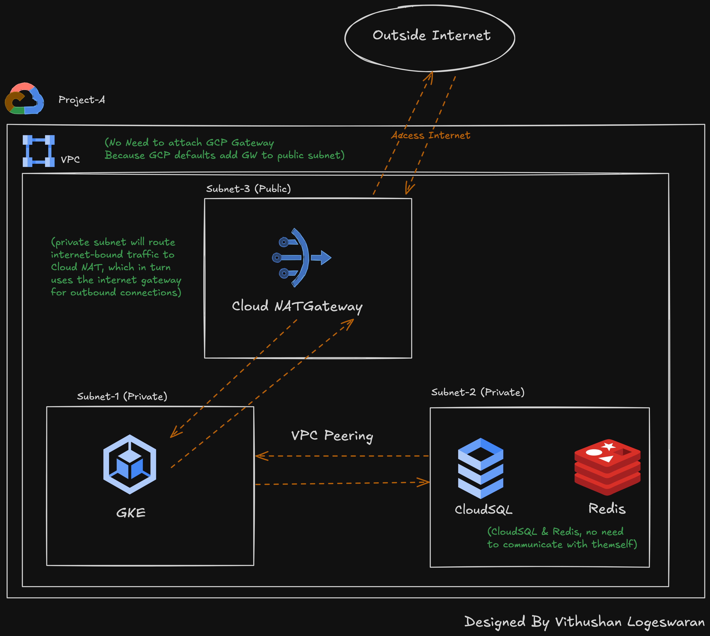

### **1. High-Level Architecture Diagram**

Below is a description of the high-level architecture:

- **Custom VPC**:
  - A custom VPC spans multiple regions for scalability and resilience.
  - Three subnets:
    - **Subnet 1** (Private): For GKE worker nodes.
    - **Subnet 2** (Private): For CloudSQL and Redis.
    - **Subnet 3** (Public): For any external-facing services (e.g., Load Balancers).

- **GKE Cluster**:
  - Deployed in **Subnet 1** for application workloads. Private nodes ensure no public IP exposure.
  - Uses a **Cloud NAT** gateway for outbound internet traffic.

- **CloudSQL and Redis**:
  - Deployed in **Subnet 2** using private IP addresses. Communication with GKE occurs within the VPC.

- **Firewall Rules**:
  - Restrict traffic to only what is necessary.
  - Explicit rules allow traffic between GKE, CloudSQL, and Redis while blocking all other traffic.

- **Private DNS**:
  - Configured to resolve internal service names (e.g., CloudSQL instance private endpoint).

---

### **2. Summary**

#### **Securing the Setup**

1. **Network Segmentation**:
   - Use **private subnets** to isolate resources.
   - Deploy CloudSQL and Redis in a separate subnet for further isolation.

2. **Firewall Rules**:
   - Define explicit **allow rules** for required communication:
     - Allow GKE pods to connect to CloudSQL (`tcp:3306`) and Redis (`tcp:6379`).
   - Deny all other traffic by default.

3. **Private Access**:
   - Use **private IP addresses** for all resources (CloudSQL, Redis, and GKE nodes).
   - Use **Cloud NAT** for GKE nodes to access the internet without exposing their IPs.

4. **Authentication and Encryption**:
   - Use **IAM roles** and **service accounts** for secure access between GCP services.
   - Enable **TLS encryption** for communication with CloudSQL and Redis.
   - Use Kubernetes **Secrets** to securely store database and Redis credentials.

5. **Access Control**:
   - Restrict external access to only the Load Balancer, which routes traffic to GKE services.
   - Use **Identity-Aware Proxy (IAP)** to secure access to administrative interfaces.

---

#### **Optimizing Costs While Maintaining High Availability**

1. **Right-Sizing Resources**:
   - Use **autoscaling** for GKE node pools to handle traffic spikes while minimizing idle resources.
   - Choose CloudSQL and Redis instance sizes based on current workload requirements, with an option to scale as needed.

2. **Preemptible VMs**:
   - Use **preemptible VMs** for non-critical workloads or batch processing in GKE to save costs.

3. **High Availability Setup**:
   - Enable **multi-zone GKE clusters** to distribute workloads across multiple zones.
   - Configure **CloudSQL high availability (HA)** for automatic failover.

4. **Networking Costs**:
   - Use private communication between services to minimize **egress charges**.
   - Avoid unnecessary internet traffic by leveraging **Cloud NAT**.

5. **Storage Optimization**:
   - Optimize CloudSQL and Redis storage by using automatic storage scaling and periodic cleanup of unused data.

